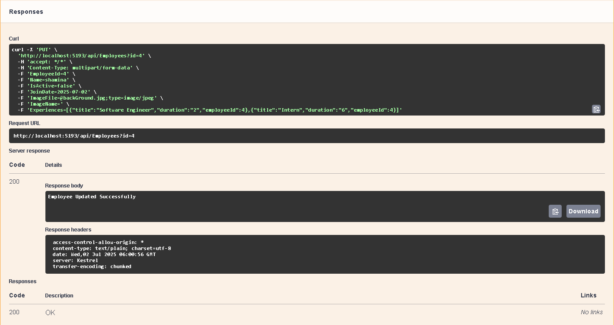

"# CoreWebAppWithApi" 

```
This is a simple Employee Management application built using ASP.NET Core MVC for the client-side and ASP.NET Core Web API for the server-side. The application supports CRUD operations — Create, Read, Update, and Delete employees.

Features:

Create new employee records

View employee details

Update employee information

Delete employee records

RESTful API backend with ASP.NET Core Web API

MVC client-side UI with ASP.NET Core MVC

Technologies Used:

Client: ASP.NET Core MVC, Bootstrap (optional for UI styling)

Server: ASP.NET Core Web API

Database: SQL Server 

Data Access: Entity Framework Core 

Tools: Visual Studio 

Getting Started:

Prerequisites
.NET 8 SDK 

SQL Server or SQL Server Express

Visual Studio 2022 

Setup:
Clone the repository:

git clone [https://github.com/your-username/repositoryName] (https://github.com/Sornali-Sanu/CoreWebAppWithApi).git

cd employee-management
Update the database connection string in appsettings.json files for both client and server projects.

Run database migrations or create the database schema manually.

Build and run the Web API project:

cd AspCoreApiAndClientDln.Server
dotnet run
Build and run the MVC client project:


cd AspCoreApiAndClientDln.Client
dotnet run
Open your browser and navigate to https://localhost:xxxx ( the URL shown in your terminal) to access the app.

API Endpoints (Sample)
HTTP Method	URL	Description
GET	/api/employees	Get all employees
GET	/api/employees/{id}	Get employee by ID
POST	/api/employees	Create a new employee
PUT	/api/employees/{id}	Update employee details
DELETE	/api/employees/{id}	Delete employee

Project Structure

AspCoreApiAndClientDln/
│
├── AspCoreApiAndClientDln.server/       # Web API project (server)
├── AspCoreApiAndClientDln.Client/       # ASP.NET Core MVC client project
               
Future Improvements:

Add authentication and authorization

Add role-based access control

Implement paging and searching on employee list

Improve UI/UX design with more responsive layouts

Add unit and integration tests

## Screenshot
```
GET Response:

```


```
Get By Id Response:

```


```
Post Request:

```


```
Post Response:

```


```
Put Request

```


```
put response
```


```
Delete:

```


```
Database:

Employee:
```

```
Experiences

```


```
Index:
```


```
Create:
```


```
Update:
```


```
Details:
```


